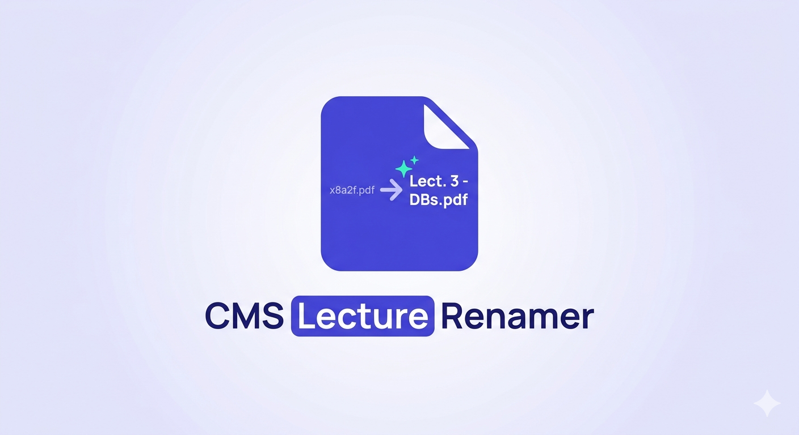

<p align="center">
   
</p>

# CMS Lecture Renamer

A lightweight browser extension (Microsoft Edge + Chrome) that automatically renames downloaded lecture files to their actual lecture title instead of the random ID the CMS assigns them.

This solution is mainly built for **GIU CMS** and similar layouts.

## The Problem

When you download a lecture from your university CMS, the file saves as something like:

```
GIU_2959_68_29946_2026-03-07T14_34_50.pptx
```

Instead of the actual name visible on the page:

```
1 - Lecture 2 (Lecture slides).pptx
```

This extension fixes that.

## How It Works

1. When you click a **Download Content** button on the CMS, the extension reads the lecture title from the same card on the page.
2. When Edge/Chrome is about to save the file, the extension tells the browser to use the lecture title as the filename instead.
3. The file saves with the correct name — no manual renaming needed.

Nothing is automated, nothing is sent anywhere. It only acts on files **you** choose to download.

## Installation

Since this extension is not on any store, load it manually.

### Microsoft Edge (recommended)

1. Download or clone this repository
   ```bash
   git clone https://github.com/YOUR_USERNAME/cms-renamer.git
   ```
2. Open Edge and go to `edge://extensions`
3. Enable **Developer mode** (toggle in the left sidebar)
4. Click **Load unpacked**
5. Select the `cms-renamer` folder

The extension is now active in Edge.

### Google Chrome

1. Download or clone this repository
   ```bash
   git clone https://github.com/YOUR_USERNAME/cms-renamer.git
   ```
2. Open Chrome and go to `chrome://extensions`
3. Enable **Developer mode** (toggle in the top-right corner)
4. Click **Load unpacked**
5. Select the `cms-renamer` folder

The extension is now active in Chrome. No configuration needed.

## Permissions

| Permission | Why it's needed |
|---|---|
| `downloads` | To intercept the filename at the moment the browser saves the file |

No network access, no storage, no tabs access. The extension only communicates internally between its own content script and background worker.

## Privacy

- Does **not** collect any data
- Does **not** send anything to any server
- Does **not** run any code outside of your CMS page
- Does **not** bypass login, DRM, or access restrictions
- All logic runs locally inside your browser

## File Structure

```
cms-renamer/
├── manifest.json   # Extension config & permissions
├── background.js   # Intercepts the download and applies the new filename
├── content.js      # Reads the lecture title from the page on click
└── README.md
```

## Compatibility

Mainly targeted at **GIU CMS** (and tested there), where download links are rendered in a card-based layout. The DOM traversal logic is flexible enough to work on similar university CMS platforms.

Browser compatibility:
- Microsoft Edge (Chromium)
- Google Chrome

If your CMS has a different structure and filenames still come out wrong, open an issue with a screenshot of the DevTools HTML for the download button area.

## Contributing

Pull requests are welcome. If you're from a different university and your CMS uses a different structure, contributions that make the selector logic more universal are especially appreciated.

## License

MIT — free to use, modify, and share.
